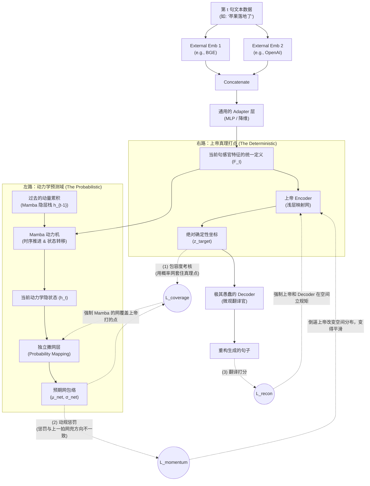

# 第一阶段 (Phase 1) 核心数据流向与理论机制图解

本文档是对 `mindstorm.md` 与 `design_phase1.md` 中理论架构的具象化图解补充，清晰展示了在抛弃旧有的“时序错位预测与外部靶标强制重构”后，全新的**内生连续空间 (Endogenous Space)** 是如何通过“上帝打点器”与“Mamba 撒网层”的物理对抗而炼成的。

## 1. 宏观数据流向图 (Phase 1 V2)

这幅 Mermaid 展现了我们如何通过“上帝”定义坐标，用“Decoder”统一刻度，再用“Mamba 上限规训”创造具有动量和物理宽容度的语义坐标系的过程。

---

## 2. 核心架构之哲学辩答：全知的上帝与盲从的废物？

在理解这张图时，架构设计师最容易陷入一个理论死胡同：
> “既然右路的【上帝 Encoder】能如此简单粗暴地打出一个毫无破绽、精准喂给 Decoder 去翻译的 $z_{target}$ 坐标点，为什么我们还要花巨大的力气在左路搭建一个用历史去推断现在的 Mamba 体系？Mamba 是不是在这个结构里成了一个盲从的跟班小弟？”

**不。Mamba 是整个宇宙物理规则的降维打击者。** 它的真实作用是：**通过自身的弱小（时间维度的计算痛点），逼迫盲目聪明的上帝妥协！**

### 2.1 孤立的上帝是个精神分裂者
上帝 Encoder 加上下游的 Decoder，构成了一个标准的自编码器。它的打点精度极高。
但问题在于，它**没有时间概念**。它在编码 $t$ 句子时，大脑里根本不存在 $t-1$ 或 $t-2$ 的位置信息。
如果放任不管，它塑造出来的空间是一个**“马赛克碎渣”**——上一句话的内容被它放在南极，下一句话由于更换了一个冷门名词，可能就被它毫无道理地丢到了北极深海。它能完美重构文本，但在这个空间里，你根本画不出一条连续的物理运动轨迹。

### 2.2 Mamba：动量规训的使者 
我们在图中加入的蓝色惩罚线 `L_momentum`，是整个宇宙的灵魂。
Mamba 的算力是有限的，它带着 $h_{t-1}$ 的沉淀一路走来，它的职责是把这股历史的车轮继续往前推。
当 Mamba 预测当前句子所在的区域（撒网），并且发现上帝居然把当前句子的靶点 $z_{target}$ 打在距离上一句话十万八千里远的地方时，Mamba 会因为无法跨越这两点而爆发出巨大的**动量断裂惩罚（$\mathcal{L}_{momentum}$）**。

### 2.3 双赢的伟大妥协：内生平滑宇宙的建立
由于在这个闭环体系中，所有的系统必须追求这三驾马车（翻译重建、包容度、动量平滑）的联合 Loss 最小化：
上帝 Encoder 被迫听到了 Mamba 的哀嚎（反向传播的梯度压力）。
**上帝妥协了。** 
上帝修改了它的特征映射法则。它开始主动地、温柔地，将那些在人类发话序列上相近的语义，在三维坐标系上也极其丝滑地连在了一起——不论它们表面上的单词差异有多大！

**这就是这个架构最暴力的美学浪漫：**
Mamba 凭借着“因为我跨不过去，如果你不把这俩词挨在一起，整个宇宙就要降下 $\mathcal{L}_{momentum}$ 天罚”的要挟，硬生生地在这片荒芜的三维矩阵里，捏造出了一条符合万物自然流转的“引力流线谱”。

掌管世界唯一对错标准的，是一只极度愚笨只能条件反射的低等生物（Decoder）。
正是因为它的愚笨，才逼得上面的上帝和先知（Encoder 与 Mamba），必须穷极智慧把这个高维宇宙梳理得像是婴儿的皮肤一样光滑连续。
